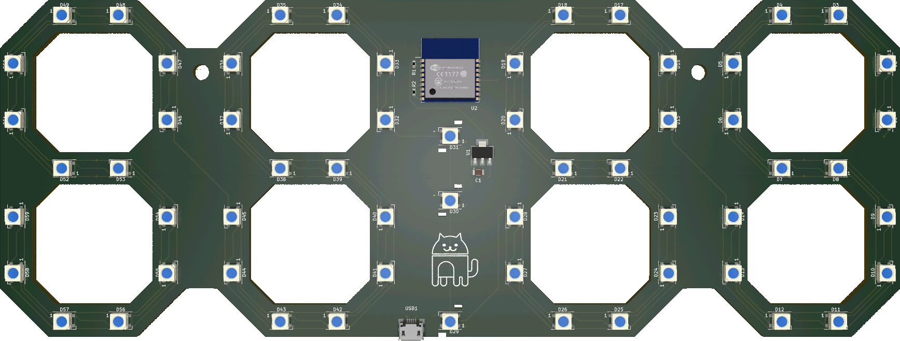
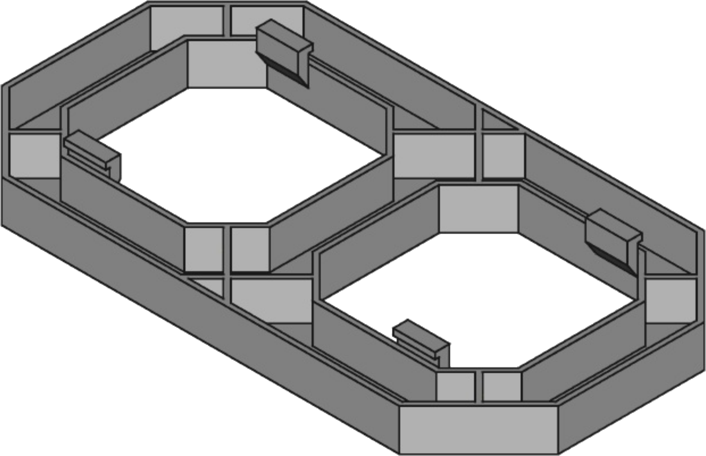

# ESP Clock

ESPC stands for [ESP](https://www.espressif.com/) Clock and is a digital IoT clock. It's connected to WiFi, automatically syncs time, shows weather information, and most importantly, has RGB! At its core, there is an ESP8266, and the display is made of WS2812B LEDs.  
It's a project I've been working on over the past few years, and it has allowed me to learn a lot about the C language and PCB designs.

This project consists of multiple repositories:

- [espc-firmware](https://github.com/Yanndroid/espc-firmware)
- espc-hardware
- [espc-python-client](https://github.com/Yanndroid/espc-python-client)
- [espc-dev-tools](https://github.com/Yanndroid/espc-dev-tools)

# ESP Clock Hardware

This repository contains the PCB and 3d models for the ESPC.

### PCB

### 3d Models

